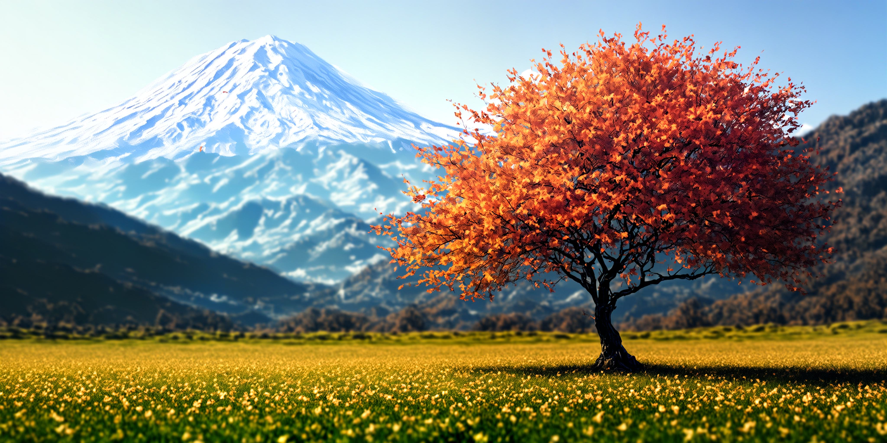

# EditCrafter: Tuning-free High-Resolution Image Editing via Pretrained Diffusion Model

<a href="https://editcrafter.github.io/"></a>
<a href="https://arxiv.org/abs/2604.10268"></a>
<a href="https://github.com/EditCrafter/EditCrafter"></a>
[](https://drive.google.com/file/d/1SEMuxQtIFI5Zfp4Ay7GsbpZKsxIo0mJX/view?usp=sharing)

[Kunho Kim](https://soulmates2.github.io/)<sup>1</sup>, [Sumin Seo](https://soochem.github.io/)<sup>2</sup>, [Yongjun Cho](https://yongjuncho.com/)<sup>3</sup>, [Hyungjin Chung](https://hyungjin-chung.github.io/)<sup>4</sup>

<sup>1</sup>NC AI &nbsp; <sup>2</sup>Medipixel, Inc. &nbsp; <sup>3</sup>MAUM.AI &nbsp; <sup>4</sup>EverEx

---

**TL;DR**: EditCrafter edits images at resolutions up to 4K (4096x4096) using pretrained text-to-image diffusion models (SD 1.5 / 2.1 / SDXL) without any fine-tuning or optimization. It combines tiled DDIM inversion for identity preservation with noise-damped manifold-constrained classifier-free guidance (NDCFG++) for high-quality text-guided editing.


## Setup

### Requirements

- Python >= 3.9
- PyTorch >= 2.0
- CUDA-capable GPU (24GB VRAM for 4K with SDXL)

### Installation

```bash
pip install torch torchvision --index-url https://download.pytorch.org/whl/cu121
pip install diffusers transformers accelerate
pip install omegaconf scipy Pillow numpy tqdm einops munch
```

Checkpoints are downloaded automatically from Hugging Face on the first run.

## Editing with text prompts

EditCrafter provides two scripts:

| Script | Backbone | Training Resolution | Max Editing Resolution |
|---|---|---|---|
| `text_guided_edit.py` | Stable Diffusion 1.5 / 2.1 | 512x512 | 2048x2048 |
| `text_guided_edit_xl.py` | SDXL 1.0 | 1024x1024 | 4096x4096 |


### Key Arguments

| Argument | Description |
|---|---|
| `--img_path` | Path to the input image |
| `--editing_prompt` | Text describing the desired edit |
| `--config` | YAML config controlling resolution, dilation, and NDCFG settings |
| `--guidance_scale` | Classifier-free guidance scale (default: 0.5) |
| `--guidance_type` | Guidance type: `cfg` or `cfgpp` (default: `cfgpp`) |

### Available Configs

<details>
<summary>Stable Diffusion 1.5 / 2.1</summary>

| Config | Resolution |
|---|---|
| `sd1.5_1024x1024.yaml` | 1024x1024 |
| `sd1.5_2048x1024.yaml` | 2048x1024 |
| `sd1.5_2048x2048.yaml` | 2048x2048 |
| `sd1.5_2048x2048_disperse.yaml` | 2048x2048 (with dispersion) |
| `sd2.1_1024x1024.yaml` | 1024x1024 |
| `sd2.1_2048x1024.yaml` | 2048x1024 |
| `sd2.1_2048x2048.yaml` | 2048x2048 |
| `sd2.1_2048x2048_disperse.yaml` | 2048x2048 (with dispersion) |

</details>

<details>
<summary>SDXL</summary>

| Config | Resolution |
|---|---|
| `sdxl_2048x2048.yaml` | 2048x2048 |
| `sdxl_4096x2048.yaml` | 4096x2048 |
| `sdxl_4096x4096.yaml` | 4096x4096 |
| `sdxl_4096x4096_disperse.yaml` | 4096x4096 (with dispersion) |

</details>

### Stable Diffusion 2.1

<table>
<tr>
<td align="center" colspan="2"><b>4x (1024x1024)</b><br><i>...<b>on a rainy street, reflecting city lights.</b></i> → <i>...<b>in a desert setting at sunset.</b></i></td>
</tr>
<tr>
<td align="center"><br>Original</td>
<td align="center"><br>Edited</td>
</tr>
</table>

```bash
python text_guided_edit.py \
    --pretrained_model_name_or_path Manojb/stable-diffusion-2-1-base \
    --img_path examples/sd21_4x_car_original.jpg \
    --editing_prompt "A high-resolution image of a shiny black sports car in a desert setting at sunset." \
    --config ./configs/sd2.1_1024x1024.yaml \
    --guidance_scale 0.5 \
    --seed 2024 \
    --guidance_type cfgpp
```

<table>
<tr>
<td align="center" colspan="2"><b>8x (2048x1024)</b><br><i><b>tiger</b></i> → <i><b>panda</b></i></td>
</tr>
<tr>
<td align="center"><br>Original</td>
<td align="center"><br>Edited</td>
</tr>
</table>

```bash
python text_guided_edit.py \
    --pretrained_model_name_or_path Manojb/stable-diffusion-2-1-base \
    --img_path examples/sd21_8x_tiger_original.jpg \
    --editing_prompt "A majestic panda emerging from the dense jungle foliage, its piercing eyes focused forward and sunlight filtering through the canopy." \
    --config ./configs/sd2.1_2048x1024.yaml \
    --guidance_scale 0.5 \
    --seed 2024 \
    --guidance_type cfgpp
```

<table>
<tr>
<td align="center" colspan="2"><b>16x (2048x2048)</b><br><i><b>chameleon</b></i> → <i><b>koala</b></i></td>
</tr>
<tr>
<td align="center"><br>Original</td>
<td align="center"><br>Edited</td>
</tr>
</table>

```bash
python text_guided_edit.py \
    --pretrained_model_name_or_path Manojb/stable-diffusion-2-1-base \
    --img_path examples/sd21_16x_chameleon_original.jpg \
    --editing_prompt "A koala perched on a branch, centered with focus on its vibrant scales." \
    --config ./configs/sd2.1_2048x2048.yaml \
    --guidance_scale 0.5 \
    --seed 2024 \
    --guidance_type cfgpp
```

### SDXL 1.0

<table>
<tr>
<td align="center" colspan="2"><b>4x (2048x2048)</b><br><i><b>dandelion seeds</b></i> → <i><b>balloon</b></i></td>
</tr>
<tr>
<td align="center"><br>Original</td>
<td align="center"><br>Edited</td>
</tr>
</table>

```bash
python text_guided_edit_xl.py \
    --pretrained_model_name_or_path stabilityai/stable-diffusion-xl-base-1.0 \
    --img_path examples/sdxl_4x_dandelion_original.jpg \
    --editing_prompt "A tranquil image of a child blowing balloon in a meadow, with soft focus on floating seeds." \
    --config ./configs/sdxl_2048x2048.yaml \
    --guidance_scale 0.5 \
    --seed 2024 \
    --guidance_type cfgpp
```

<table>
<tr>
<td align="center" colspan="2"><b>8x (4096x2048)</b><br><i><b>cherry blossom</b></i> → <i><b>maple</b></i></td>
</tr>
<tr>
<td align="center"><br>Original</td>
<td align="center"><br>Edited</td>
</tr>
</table>

```bash
python text_guided_edit_xl.py \
    --pretrained_model_name_or_path stabilityai/stable-diffusion-xl-base-1.0 \
    --img_path examples/sdxl_8x_cherry_original.jpg \
    --editing_prompt "A single maple tree in a field, with golden leaves scattered around and a tranquil mountain in the background." \
    --config ./configs/sdxl_4096x2048.yaml \
    --guidance_scale 0.5 \
    --seed 2024 \
    --guidance_type cfgpp
```

<table>
<tr>
<td align="center" colspan="2"><b>16x (4096x4096)</b><br><i><b>forest</b></i> → <i><b>burning forest</b></i></td>
</tr>
<tr>
<td align="center"><br>Original</td>
<td align="center"><br>Edited</td>
</tr>
</table>

```bash
python text_guided_edit_xl.py \
    --pretrained_model_name_or_path stabilityai/stable-diffusion-xl-base-1.0 \
    --img_path examples/sdxl_16x_bottle_original.jpg \
    --editing_prompt "A glass bottle with a miniature burning forest inside covered with fire, floating above an open field at dusk." \
    --config ./configs/sdxl_4096x4096.yaml \
    --guidance_scale 0.5 \
    --seed 2024 \
    --guidance_type cfgpp
```

## Citation

If you find this work useful, please cite:

```bibtex
@inproceedings{kim2026editcrafter,
    title={EditCrafter: Tuning-free High-Resolution Image Editing via Pretrained Diffusion Model},
    author={Kim, Kunho and Seo, Sumin and Cho, Yongjun and Chung, Hyungjin},
    booktitle={Proceedings of the IEEE/CVF Conference on Computer Vision and Pattern Recognition Workshops (CVPRW)},
    year={2026}
}
```

## Acknowledgement

This codebase is built upon [ScaleCrafter](https://github.com/YingqingHe/ScaleCrafter). We thank the authors for their excellent work.

## Contact

For questions or issues, please open a [GitHub issue](https://github.com/EditCrafter/EditCrafter/issues) or contact [Kunho Kim](https://soulmates2.github.io/).
